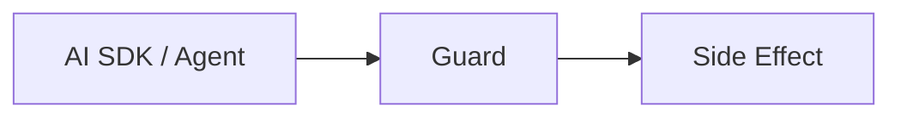

# AI SDK + KeelStack Guard

A fork of `vercel/ai` that shows how to add **runtime guardrails for TypeScript AI agents** using [`@keelstack/guard`](https://github.com/KeelStack-me/guard): **idempotent tool execution**, **per‑user AI cost budgets**, and **risk policies for irreversible actions**. This repo lets you see exactly how to wire `guard()` around Vercel AI SDK tools so retries do not double‑send emails, double‑charge Stripe, or duplicate database writes. 

[](https://www.npmjs.com/package/@keelstack/guard)
[](https://github.com/KeelStack-me/ai-with-guard)
[](./LICENSE)

> This is a **fork of [vercel/ai](https://github.com/vercel/ai)** with Guard integration examples.  
> The guardrails themselves live in [`@keelstack/guard`](https://github.com/KeelStack-me/guard), a lightweight MIT package for retry‑safe side effects in TypeScript AI agents. 

## Before vs. After: Tool Call

Visual learners love seeing the difference. Here’s a minimal “before vs. after” that shows the same tool call, with and without `@keelstack/guard`.

### Standard tool call (no guard)

```ts
import { tool } from 'ai';
import { z } from 'zod';

const sendEmailTool = tool({
  description: 'Send a confirmation email',
  parameters: z.object({ userId: z.string(), subject: z.string() }),
  execute: async ({ userId, subject }) => {
    // Agent retries → this runs again; risk of duplicates
    return resend.emails.send({
      to: await getEmail(userId),
      subject,
    });
  },
});
```

### Guard‑protected tool call

```ts
import { tool } from 'ai';
import { z } from 'zod';
import { guard } from '@keelstack/guard';
import { createHash } from 'node:crypto';

const sendEmailTool = tool({
  description: 'Send a confirmation email',
  parameters: z.object({ userId: z.string(), subject: z.string() }),
  execute: async ({ userId, subject }) => {
    // 1️⃣ Stabilize arguments into a hash
    const key = `send-email:${userId}:${createHash('sha256')
      .update(JSON.stringify({ subject }))
      .digest('hex')}`; // ← this key prevents duplicate sends

    // 2️⃣ Wrap the side effect
    const result = await guard({
      key,
      action: () =>
        resend.emails.send({
          to: await getEmail(userId),
          subject,
        }),
    });

    return result.value;
  },
});
```

Same logic, but now successive calls with the **same `key`** replay the stored result instead of executing the email again. 

## Architecture flow (Mermaid)

This diagram shows how the stack wires together:



- AI SDK invokes a tool defined with `tool()`  
- `guard()` wraps the `action` for that tool  
- Guard applies idempotency, budget, and risk checks  
- Only if allowed does the call reach the real side effect (email, Stripe, DB, etc.)

## How idempotency keys work

Idempotency in Guard is controlled entirely by the `key` string you pass.

- **Good key**: `tool:${toolName}:${userId}:${hashOfArgs}` – stable, unique per logical operation.  
- **Bad key**: `op-${Date.now()}` or a random string – changes every time, so Guard cannot replay safely.  
- **Too broad key**: `send-email` – deduplicates across all users, which is usually not what you want.

If the same key is used repeatedly, Guard:

- on first call: runs `action`, stores the result  
- on later calls: returns the cached result and skips the side effect 

You can read more about idempotency in [Stripe’s idempotent‑requests docs](https://docs.stripe.com/api/idempotent_requests) and [MDN’s `Idempotency-Key` header](https://developer.mozilla.org/en-US/docs/Web/HTTP/Reference/Headers/Idempotency-Key).

## Why this fork exists

AI frameworks like the Vercel AI SDK, LangGraph, Mastra, or OpenAI Agents SDK often retry failed or timed‑out tool calls. This improves reliability, but it becomes dangerous when the tool has side effects:

- emails can send twice  
- charges can fire twice  
- records can be duplicated  
- expensive model calls keep accumulating cost 

This fork shows how to place `@keelstack/guard` between the caller and the side effect so repeated calls can be **replayed safely instead of re‑executed**. 

## What Guard adds

This repo demonstrates three Guard primitives:

- **Idempotency gate** – repeated calls with the same key replay the stored result instead of running the action again.   
- **Budget enforcer** – blocks execution if per‑user spend is above a configured limit.   
- **Risk gate** – classifies actions as `safe`, `reversible`, or `irreversible`, then allows, logs, warns, or blocks. 

The underlying AI SDK remains the Vercel AI SDK; this fork only adds Guard‑based examples and integration patterns. 

## What changed in this fork

- Guard integrated into AI tool execution examples  
- Stable idempotency key format: `tool:${toolName}:${userId}:${hash(args)}`  
- Optional per‑user budget controls  
- Optional risk policy configuration  
- Duplicate‑prevention example script  
- Test coverage for replay behavior 

## Quick demo

Install dependencies:

```bash
pnpm install
```

Run the Guard demo:

```bash
pnpm --filter @example/ai-functions exec tsx ../with-guard.ts
```

Expected behavior:

- first call → `status: "executed"`, `fromCache: false`  
- second identical call → `status: "replayed"`, `fromCache: true`  
- the side effect runs only once 

## Example Guard usage

```ts
import { guard } from '@keelstack/guard';
import { createHash } from 'node:crypto';

const key = `tool:${toolName}:${userId}:${createHash('sha256')
  .update(JSON.stringify(args))
  .digest('hex')}`; // ← this key prevents duplicate runs

const result = await guard({
  key,
  action: () => runTool(args),
  budget: {
    id: userId,
    limitUsd: 5,
    warnAt: [0.5, 0.8],
  },
  extractCost: () => 0.001,
  risk: {
    level: 'irreversible',
    policy: 'warn',
  },
});
```

- `status` is either `"executed"`, `"replayed"`, `"blocked:budget"`, or `"blocked:risk"`  
- `fromCache` indicates whether the value came from storage 

## When to use this repo vs `@keelstack/guard`

- Use **this repository** if you want to study or test Guard integration patterns inside a realistic AI SDK monorepo with multiple examples. 
- Use **`@keelstack/guard`** directly if you just want the reusable package in your own TypeScript AI agent, server, or framework. 

## Support

- Issues about the **Vercel AI SDK core** → [vercel/ai issues](https://github.com/vercel/ai/issues)  
- Issues about **Guard integration in this fork** → open them here  
- Issues about **the Guard package** → [KeelStack‑me/guard issues](https://github.com/KeelStack-me/guard) 

<!-- 
Search discovery metadata:
AI agent guardrails, runtime guardrails for AI agents, idempotent AI tool execution, 
Vercel AI SDK guardrails, TypeScript AI agent safety, retry-safe AI tools
-->

## Attributions

Credit to the Vercel AI SDK team for the upstream framework; this fork exists to show how Guard patterns fit into that stack. The Guard package is maintained by KeelStack. 